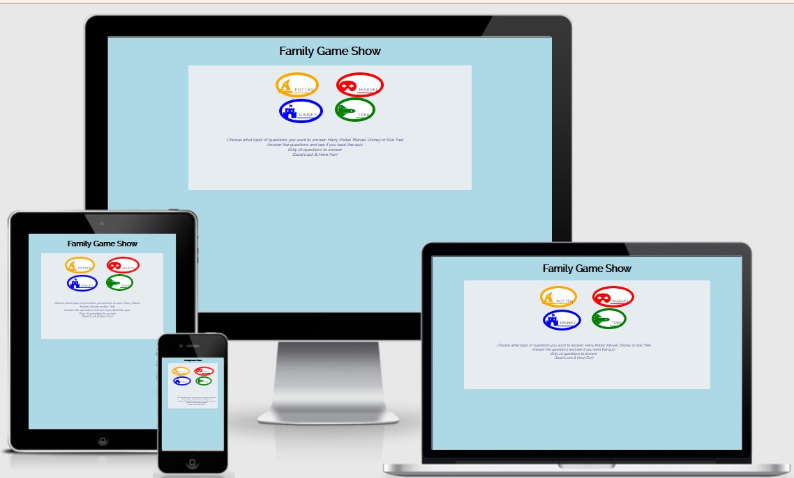
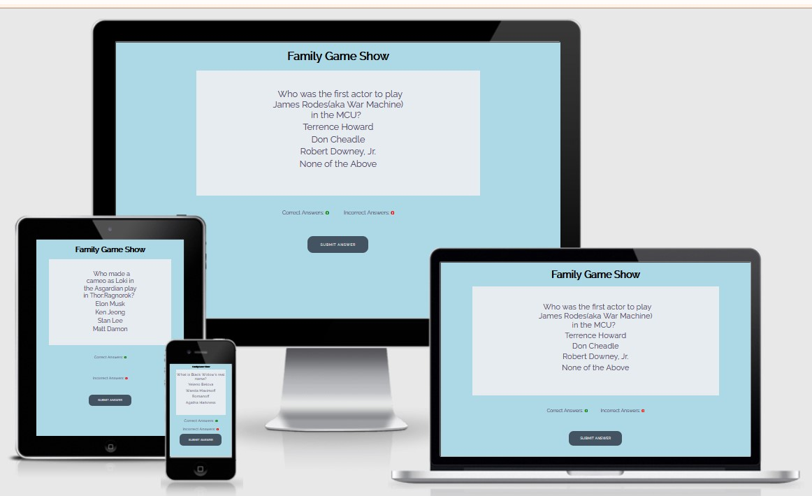
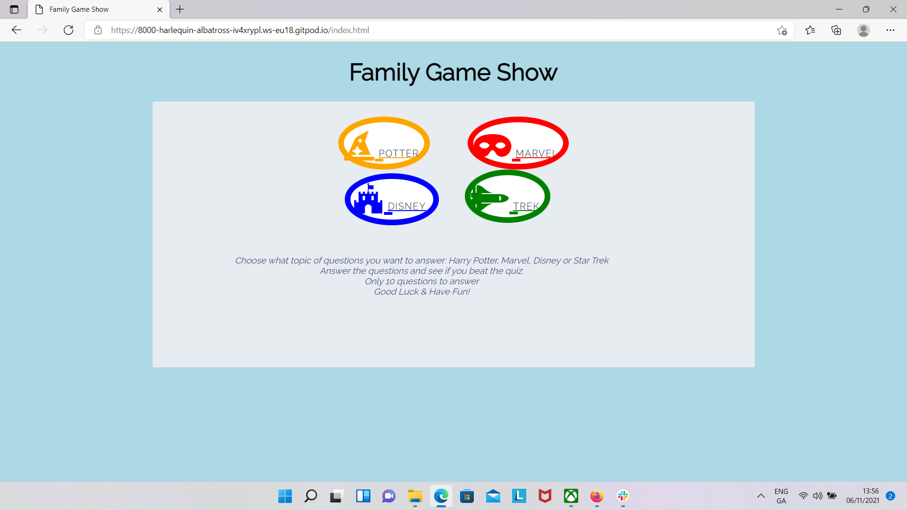
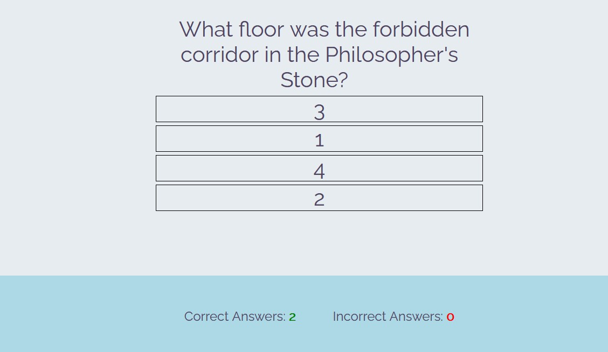
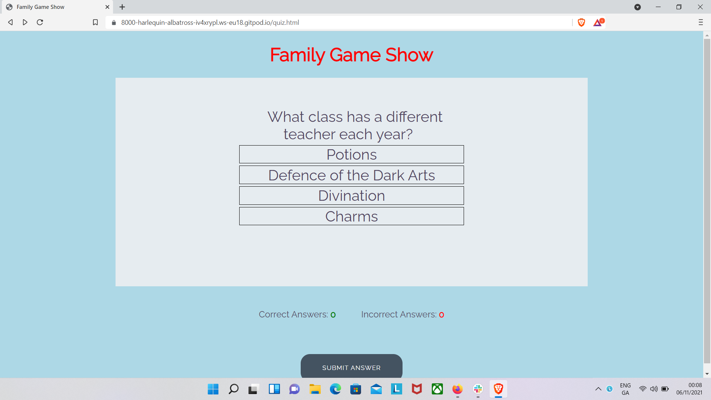
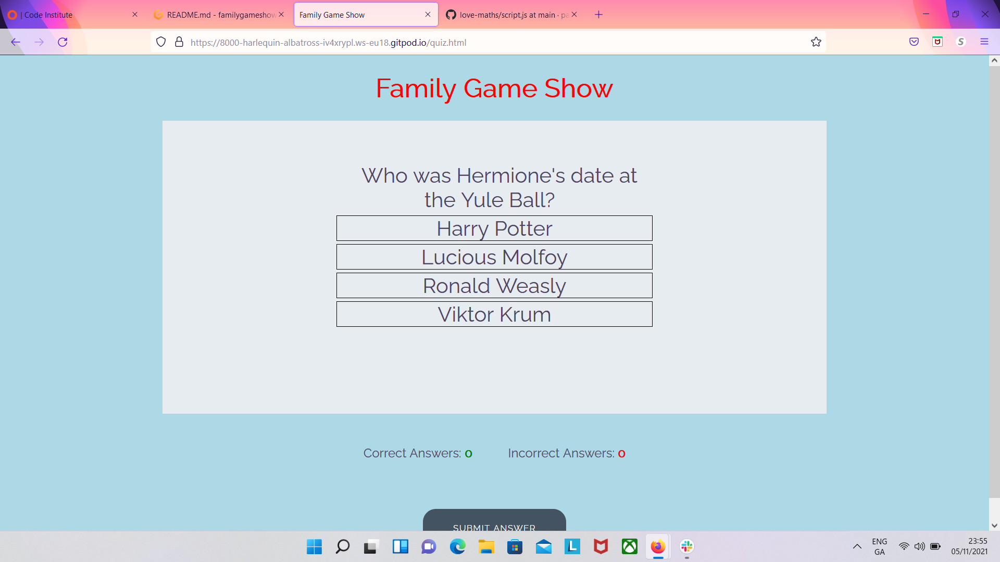

# Family Game Show

## User Stories:
- _First time Visitor Goals_
  - As a first time user of this site, I would like to be able to easily decifer the main purpose of the game
  - As a first time user, I would like to be able to easily navigate the game
  - As a first time user, I would like to see my score

- _Returning Visitor Goals:_ 
  - As a returning visitor, I would like to be able to choose a different category of questions
  - As a returning visitor, I would like to be able to take the quiz again and possibly do better than the first time

## Languages Used:

- _HTML_
- _CSS_
- _JavaScript_

## Frameworks, Libraries & Programs Used:

- [Google Fonts](https://fonts.google.com/):_ 
- [Font Awesome](https://fontawesome.com/): used to add buttons for choosing quiz type
- [Git](https://git-scm.com): used to utilize the Gitpod terminal to commit to Git and Push to GitHub
- [GitHub](https://github.com/): used to store project code after being pushed from Git
- [Balsamiq](https://balsamiq.com/) Used to create the wire frame for the project during the planning phase
- [ColorSpace](https://mycolor.space) Used as a reference of colors that could be used.
- [ImageColorPicker](https://imagecolorpicker.com/en/user/shared-palette?id=308363078299288132): 
- [Am I Responsive?](http://ami.responsivedesign.is/) Used on Readme to show how the application looks on different devices.
- [Pixabay](https://pixabay.com/) Used for pictures for the background of the project. (not sure if I will be using them)

- _Jshint_ - 
  - 

- _W3C Markup Validator Results_ - 
  - 

- _Jigsaw Validator Results_
  - 

- _Design:_
  - _Color Scheme:_ 

- _Typography:_
  - 

- _Imagery:_

  - background photo at []

- _Balsamiq Wireframes:_

  - Wireframes at [this link](testing-wireframes/family-game-night.pdf)
## Features:

- _Responsive on all device sizes_

  - _Desktop_

    - 
  - _Tablet_

    - 
  - _Cell Phone_

    - 

- _Interactive Elements_

  -  The buttons on this page make it possible to easily navigate to the game that the user wishes to play. 

    - 

  - The user clicks on the correct answer and continues on to the next question
    - 

  
## Future Additions to page

- Mutiplayer function
- Ability to go between quizes
- Ability to compare your score to others that have played the game with a score page.
- Add a timed component to the game.

## Testing User Stories from User Experience Section

- _First time Visitor Goals_

  - _As a first time user of this site, I would like to be able to easily decifer the main purpose of the game_
  - - The instructions on the page quickly and easily explain how the game works and your choices that are above it are listed.

    - 

  - _As a first time user, I would like to be able to easily navigate the game_
  - - The buttons on the first page take you quickly and easily to the quiz of your choice. When you get to the quiz you click on the answer and are told if the question is right or wrong. 

    - 

  - _As a first time user, I would like to see my score_ 
  - - The score is easily visable at the bottom of the quiz page.

    - 

- _Returning Visitor Goals:_ 

  - _As a returning visitor, I would like to be able to choose a different category of questions_
  - - This is possible once you end the game. All you need to do is choose a different category of questions.

     - 

  - _As a returning visitor, I would like to be able to take the quiz again and possibly do better than the first time_ 
  - - After completing the quiz you can easily retake the quiz and try and achieve a higher score.

    - 

## Further Testing
  - The Website was tested on: 
    - _Microsoft Edge_

      - 

    - _Firefox_

      - 

    - _Brave browsers_

      - 

  - The website was viewed on a variety of devices such as Desktop, Laptop, Samsung Galaxy Tablet and Samsung Galaxy 7, Samsung Galaxy 8, Samsung A12.
  - A large amount of testing was done to ensure that all of the pages were linking correctly. 
  - Friends and family members were asked to review the site and documentation to point out any bugs and/or user experience issues. I aso had my client test the website to see if it was what they wanted.

## Known Bugs
- Had difficulty getting from index.html to quiz.html using buttons for quiz choice. _This was fixed by putting href instead of button._  
- Had difficulty with getting questions to print on quiz page.  _This was fixed code to randomly choose question and write the answers._
- Need to have answer be chosen by the user. I was going to have the user enter a letter but may have user either click answer or on radio button. _replaced code that was for answer box with code that will allow the user to click on the correct answer_
- Answers were marked incorrectly. _I put code in to let previous questions answer be cleared before reading next question._
- Difficulty getting questions to end after 10 questions. _First I had an endless line withe the last question over and over at end of quiz.  Next I got it to stop at 9 instead of 10. Finally I added code to bring the user back to the index.html page to be able to either retake the quiz or choose another quiz._
- Questions don't end when the 10th question is asked _Wrote code to get the game to end after 10 questions and return the user to the page with the choice of type of game so they can replay or change game type._
- Other games are not connected _ _

## Deployment

- The site was deployed to GitHub. I used the steps listed below to deploy. 
  - In the GitHub repository, go to the Settings tab 
  - Use the source section drop-down menu and select the Master Branch
  - Once the master branch has been selected, the page will be automatically refreshed with a detailed ribbon display to indicate the successful deployment. 

The live link can be found here - https://pattytonyoneill.github.io/familygameshow/

### Local Deployment

In order to make a local copy of this repository, you can clone it by typing the following into your IDE Terminal:

- `git clone https://github.com/pattytonyoneill/familygameshow.git`

Alternatively, if you use Gitpod, you can [click here](https://gitpod.io/#https://github.com/pattytonyoneill/familygameshow)

## Credits

### Code
- _Readme used sample readme from code institute as a model. [Github](https://github.com/Code-Institute-Solutions/readme-template/blob/master/README.md)_

### Content
- _All content written by the developer._

### Media
_Images came from pixabay.com_
_Icons used came from fontawesome_

### Acknowlegements
- _My Mentor for his help and feedback._
- _Tutor support at Code Institute_
- _Nick and Jack Conroy on slack for their help and feedback._
- _Family for help with help and feedback on website as a use_