# Family Game Show
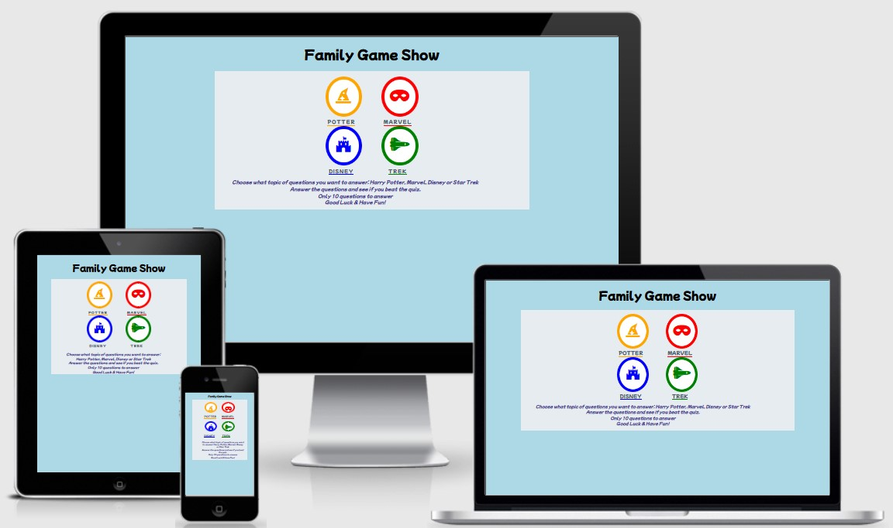
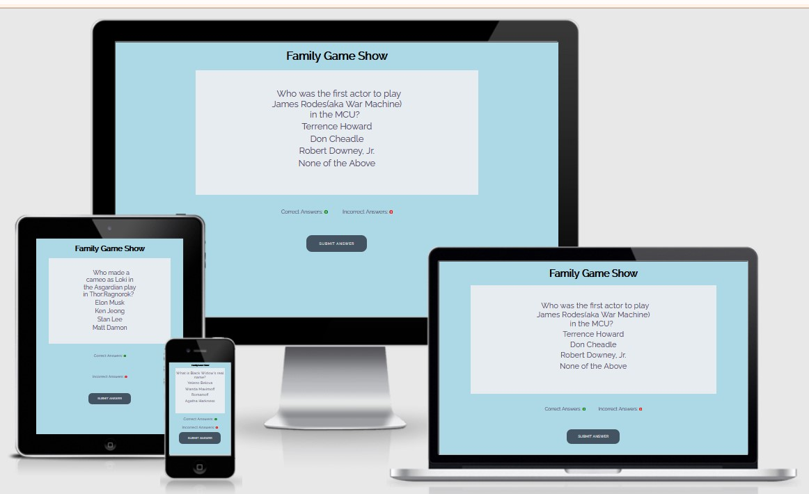

## User Stories:
- _First time Visitor Goals_
  - As a first time user of this site, I would like to be able to easily decifer the main purpose of the game
  - As a first time user, I would like to be able to easily navigate the game
  - As a first time user, I would like to see my score

- _Returning Visitor Goals:_ 
  - As a returning visitor, I would like to be able to choose a different category of questions
  - As a returning visitor, I would like to be able to take the quiz again and possibly do better than the first time

## Languages Used:

- _HTML_
- _CSS_
- _JavaScript_

## Frameworks, Libraries & Programs Used:

- [Google Fonts](https://fonts.google.com/): used to import Raleway and Mochiy Pop P One, and into the style.css file which was used on the project
- [Font Awesome](https://fontawesome.com/): used to add buttons for choosing quiz type
- [Git](https://git-scm.com): used to utilize the Gitpod terminal to commit to Git and Push to GitHub
- [GitHub](https://github.com/): used to store project code after being pushed from Git
- [Balsamiq](https://balsamiq.com/) Used to create the wire frame for the project during the planning phase
- [ColorSpace](https://mycolor.space) Used as a reference of colors that could be used.
- [ImageColorPicker](https://imagecolorpicker.com/en/user/shared-palette?id=308363078299288132): 
- [Am I Responsive?](http://ami.responsivedesign.is/) Used on Readme to show how the application looks on different devices.

- _Jshint_
  -I am aware of the warning on line 58 and it is an acceptable warning.
  -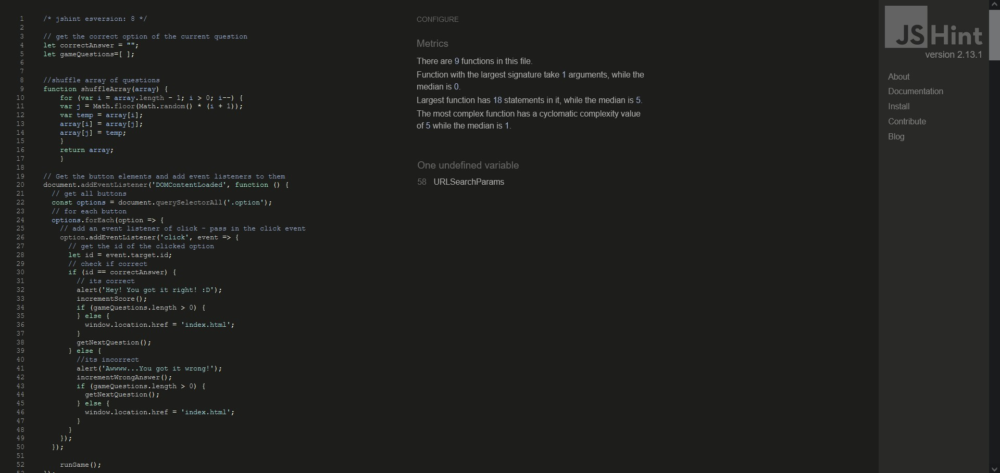

- _W3C Markup Validator Results_ 
  - This is the validator for the index.html.
  - 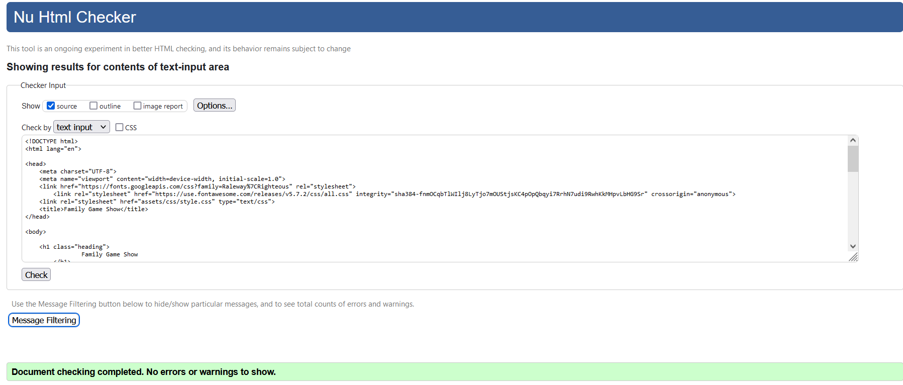

  - This is the validator for the quiz.html.
  - 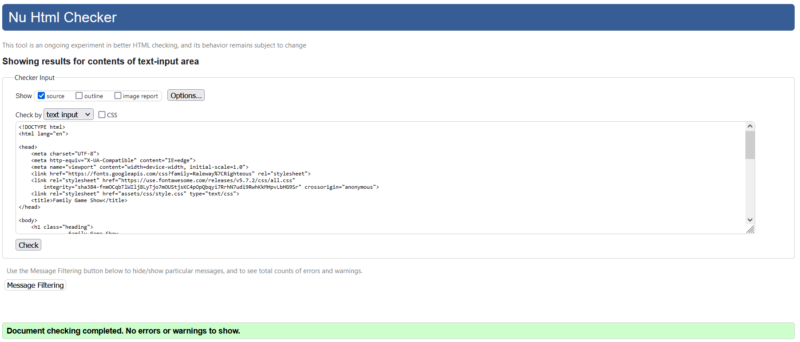

- _Jigsaw Validator Results_
  - 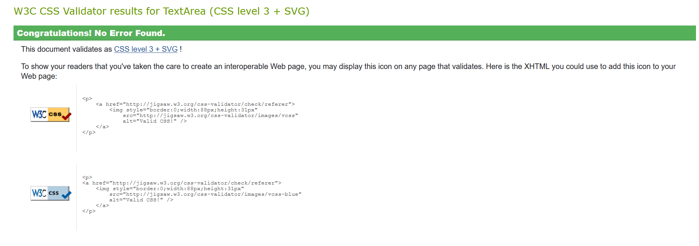

- _Typography:_
  - Raleway is the font used in this website san-serif is the backup in case one of the font does not import correctly. 

- _Balsamiq Wireframes:_

  - Wireframes at [this link](documentation/wireframes/family-game-night.pdf)
## Features:

- _Responsive on all device sizes_

  - _Desktop_

    - 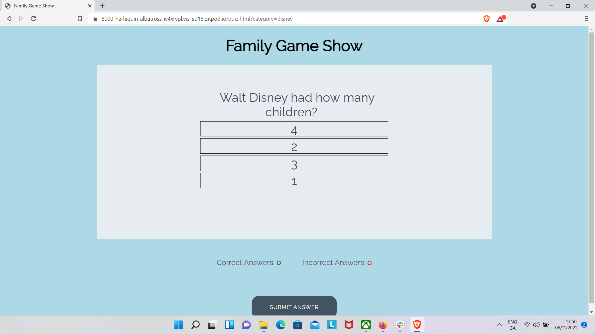

  - _Tablet_

    - 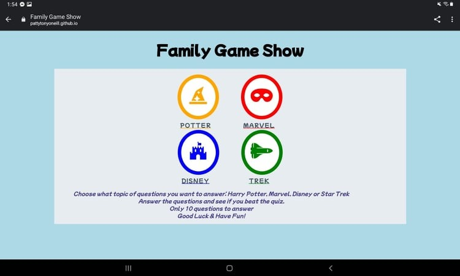
  - _Cell Phone_

    - 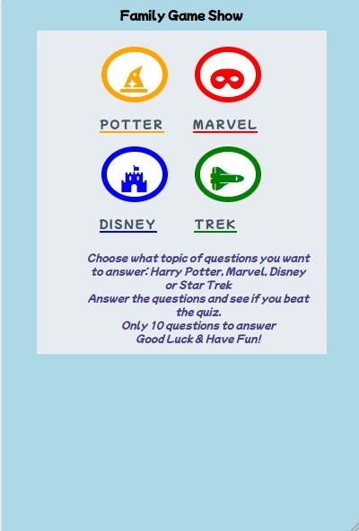

- _Interactive Elements_

  -  The buttons on this page make it possible to easily navigate to the game that the user wishes to play. 

    - 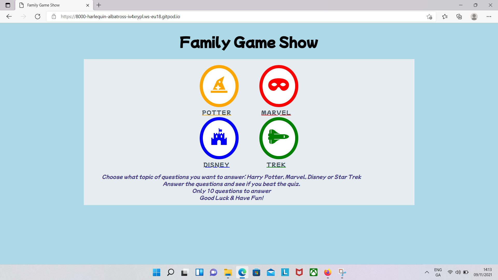

  - The user clicks on the correct answer and continues on to the next question
    - 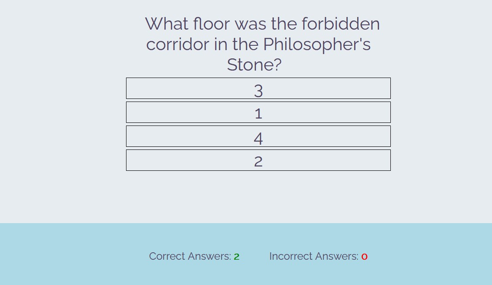

  
## Future Additions to page

- Mutiplayer function
- Ability to go between quizes
- Ability to compare your score to others that have played the game with a score page.
- Add a timed component to the game.

## Testing

For all testing please refer to [TESTING.md](TESTING.md)

## Deployment

- The site was deployed to GitHub. I used the steps listed below to deploy. 
  - In the GitHub repository, go to the Settings tab 
  - Use the source section drop-down menu and select the Master Branch
  - Once the master branch has been selected, the page will be automatically refreshed with a detailed ribbon display to indicate the successful deployment. 

The live link can be found here - https://pattytonyoneill.github.io/familygameshow/

### Local Deployment

In order to make a local copy of this repository, you can clone it by typing the following into your IDE Terminal:

- `git clone https://github.com/pattytonyoneill/familygameshow.git`

Alternatively, if using Gitpod, you can click below to create your own workspace using this repository.

## Credits

### Code
- _Readme used sample readme from code institute as a model. [Github](https://github.com/Code-Institute-Solutions/readme-template/blob/master/README.md)_

### Content
- _All content written by the developer._

### Media
_Icons used came from fontawesome_

### Acknowlegements
- _My Mentor for his help and feedback._
- _Tutor support at Code Institute_
- _Nick and Jack Conroy on slack for their help and feedback._
- _Family for help with help and feedback on website as a use_