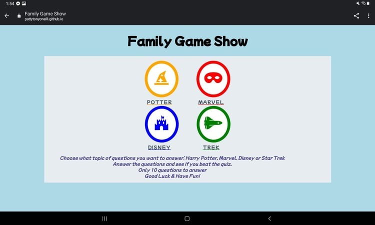

Return to [README.md](README.md)

## Testing User Stories from User Experience Section

- _First time Visitor Goals_

  - _As a first time user of this site, I would like to be able to easily decifer the main purpose of the game_
  - - The instructions on the page quickly and easily explain how the game works and your choices that are above it are listed.

    - 

  - _As a first time user, I would like to be able to easily navigate the game_
  - - The buttons on the first page take you quickly and easily to the quiz of your choice. When you get to the quiz you click on the answer and are told if the question is right or wrong. 

    - 

  - _As a first time user, I would like to see my score_ 
  - - The score is easily visable at the bottom of the quiz page.

    - 

- _Returning Visitor Goals:_ 

  - _As a returning visitor, I would like to be able to choose a different category of questions_
  - - This is possible once you end the game. All you need to do is choose a different category of questions.

     - 

  - _As a returning visitor, I would like to be able to take the quiz again and possibly do better than the first time_ 
  - - After completing the quiz you can easily retake the quiz and try and achieve a higher score.

    - - 

## Further Testing
  - The Website was tested on: 
    - _Microsoft Edge_

      - 

    - _Firefox_

      - 

    - _Brave browser_

      - 

    - _Chrome browser_

      - 

  - The website was viewed on a variety of devices such as Desktop, Laptop, Samsung Galaxy Tablet and Samsung Galaxy 7, Samsung Galaxy 8, Samsung A12.
  - A large amount of testing was done to ensure that all of the pages were linking correctly. 
  - Friends and family members were asked to review the site and documentation to point out any bugs and/or user experience issues. 

## Known Bugs
- Had difficulty getting from index.html to quiz.html using buttons for quiz choice. _This was fixed by putting href instead of button._  
- Had difficulty with getting questions to print on quiz page.  _This was fixed code to randomly choose question and write the answers._
- Need to have answer be chosen by the user. I was going to have the user enter a letter but may have user either click answer or on radio button. _replaced code that was for answer box with code that will allow the user to click on the correct answer_
- Answers were marked incorrectly. _I put code in to let previous questions answer be cleared before reading next question._
- Difficulty getting questions to end after 10 questions. _First I had an endless line withe the last question over and over at end of quiz.  Next I got it to stop at 9 instead of 10. Finally I added code to bring the user back to the index.html page to be able to either retake the quiz or choose another quiz._
- Questions don't end when the 10th question is asked _Wrote code to get the game to end after 10 questions and return the user to the page with the choice of type of game so they can replay or change game type._
- Other games are not connected _This was done by connecting code and condensing my code_
- Buttons needed to be rounded. _I corrected this by editing the css style code_
